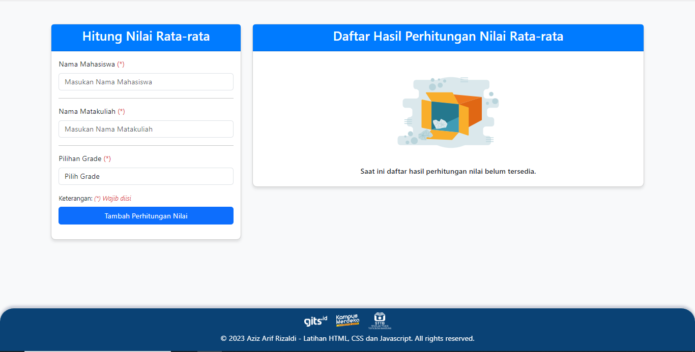

# msib5-latihan-html-css-javascript

Repository ini digunakan untuk latihan HTML, CSS, dan Javascript dalam kelas MSIB 5 di GITS.ID.

Demo Aplikasi bisa diakses melalui link berikut: [Demo Aplikasi](https://msib5-latihan-html-css-javascript.vercel.app/){:target="_blank"}

## Screenshot Awal Tampilan Website

Setelah berhasil menyimpan data _(dengan menambahkan perhitungan nilai)_, data yang disimpan akan muncul di sebelah kanan. _(Menampilkan daftar perhitungan nilai)_

## Screenshot Tampilan Website Setelah Data Ditambahkan

